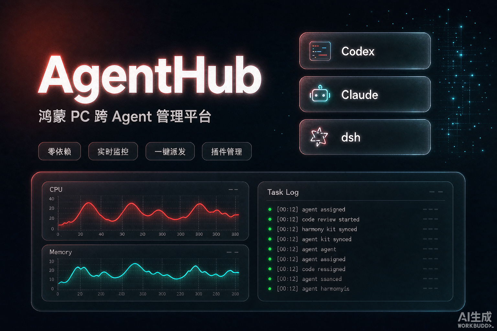

<p align="center">
  
</p>

# AgentHub · 鸿蒙 PC 跨 Agent 管理平台

集中管理 **Codex / Claude / dsh** 三个 Agent 的轻量管理平台：实时资源与工作状况监控、报错收集、对话窗任务派发（选 Agent / 选模型 / 选思考强度）、Agent 启停、插件与技能管理。

- 纯 Node 实现，**零 npm 依赖**（仅内置模块），无原生二进制
- Web UI 商务简约风，无框架，开箱即用
- 团队共享上下文与共享记忆：提交任务自动注入相关上下文、按标签/关键词召回长期记忆
- 完整生命周期命令：安装 / 启动 / 健康检查 / 修复 / 卸载一条龙
- 运行时：Node ≥ 18（本机实测 v22.7.0）
- 服务：`127.0.0.1:8899`（可用 `HUB_PORT` 覆盖）

---

## 快速安装

在鸿蒙 PC 的 **HiShell 终端**中：

```sh
git clone https://github.com/Entity-Him/AgentHub.git
cd AgentHub
sh hish install        # 完整安装:校验环境 + 建数据目录 + 安装 hish 命令
```

`install` 会依次完成：

1. 校验 Node（未找到时可用 `HUB_NODE` 指定路径）
2. 创建数据目录 `data/logs`、`data/backups`
3. 校验服务端入口与 dsh headless 适配补丁
4. 将 `hish` 软链到 `~/.local/bin/hish`，之后可直接执行 `hish`（失败不影响使用，继续用 `sh hish` 即可）

安装完成后浏览器访问 **http://127.0.0.1:8899**。

> 跳过自动软链：`HUB_SKIP_LINK=1 sh hish install`

## 启动与停止

```sh
hish start        # 启动(幂等,带健康检查,失败自动给出日志)
hish stop         # 停止
hish restart      # 重启
```

## 状态 · 健康检查 · 修复

```sh
hish status       # 运行状态 + 最近日志
hish health       # 健康检查(/api/health),退出码 0=健康
hish repair       # 自检并自动修复
hish log          # 跟踪日志
hish test         # 单元自测(无需服务在线)
```

`repair`（别名 `fix`）会自动处理常见故障：

- 补齐缺失的数据目录
- 清理已失效的陈旧 pid 文件
- 进程存活但健康检查失败 → 强制重启
- 服务未运行 → 自动启动
- 端口被其他实例占用 → 明确提示，不误杀

## 卸载

```sh
hish uninstall            # 停止服务 + 移除 ~/.local/bin/hish 软链(保留数据)
hish uninstall --purge    # 连 data/(配置/日志/任务历史) 一并删除
```

## 命令一览

| 命令 | 说明 | 退出码 |
|---|---|---|
| `hish install` | 完整安装（校验环境 / 建目录 / 装命令软链） | 0=成功 |
| `hish deploy` | 部署检查（兼容旧版） | 0=成功 |
| `hish start` | 启动（幂等，带健康检查） | 0=已就绪 |
| `hish stop` | 停止 | 0 |
| `hish restart` | 重启 | 0=已就绪 |
| `hish status` | 运行状态 + 最近日志 | 0 |
| `hish health` | 健康检查 | 0=健康，1=异常 |
| `hish repair` | 自检修复（`fix` 为别名） | 0=修复后健康 |
| `hish log` | 跟踪日志 | 0 |
| `hish test` | 单元自测（无需服务在线） | 0=通过 |
| `hish uninstall` | 卸载（`--purge` 删数据） | 0 |
| `hish version` | 查看版本 | 0 |

## 环境变量

| 变量 | 默认值 | 说明 |
|---|---|---|
| `HUB_PORT` | `8899` | 服务端口 |
| `HUB_NODE` | 自动探测 | node 可执行文件路径 |
| `HUB_LOG` | `data/hub.log` | 日志文件路径 |
| `HUB_SKIP_LINK` | 空 | 设为 `1` 时 install 跳过命令软链 |
| `DSH_NODE` | 同 `HUB_NODE` | dsh headless 用 node |
| `DSH_DIR` | `~/dsh-test` | dsh 安装目录 |
| `DSH_WEB_SCRIPT` | `~/bin/dsh-web.sh` | dsh web 启动脚本 |

---

## 架构

```
┌────────────────────────── HiShell 终端 (hish start) ────────────────────────────┐
│                                                                                   │
│  AgentHub  (server/index.js, 纯 Node, 零依赖)                                     │
│  ├── monitor    /proc 直读 + ps 兜底, 2s 采样系统/进程 CPU、内存、负载、磁盘        │
│  ├── runner     任务队列(每 Agent 串行) + SSE 流式输出 + 取消 + 持久化             │
│  ├── logstore   环形日志 + stderr 错误模式识别 + 落盘 data/logs/                   │
│  ├── agents     codex / claude / dsh 执行器(探测·启停·模型/强度映射)              │
│  └── plugins    dsh 插件(plugins-src)与 Skills 扫描·启停(带备份)                  │
│  └── memory     团队共享上下文 + 共享记忆(CRUD/召回/prompt 注入,落盘 data/memory) │
│        │                                                                          │
│        ├──→ codex exec (DeepSeek 直连)                                            │
│        ├──→ claude -p (未安装时优雅降级)                                          │
│        └──→ node dsh/bin.js --profile headless (鸿蒙适配补丁)                     │
└──────── Web UI (web/, 商务简约风, 无框架) ◀── 浏览器 http://127.0.0.1:8899 ────────┘
```

## 功能

| 页面 | 能力 |
|---|---|
| 概览 | 系统资源(CPU/内存/磁盘/负载)、Agent 在线状态与进程占用、任务计数、一键巡检全部 Agent、最近任务 |
| 任务控制台 | 对话窗写下任务 → 点选 Agent(Codex/Claude/dsh) → 选模型 → 选思考强度(低/中/高) → 发送;SSE 实时滚动输出;取消;历史重跑/查看 |
| Agent 管理 | 每 Agent 可用性探测、版本、进程占用、启用/停用(停用即终止其运行中任务)、强度映射展示 |
| 运行监控 | 系统 + 三 Agent 实时 CPU/内存条、趋势曲线(最近 200 点)、pid 明细 |
| 日志与报错 | 实时日志(按 Agent 过滤)、报错收集(错误模式识别 + 24h 分布 + 上下文) |
| 插件与技能 | dsh 插件(plugins-src)浏览/启停(改 profile 配置,自动备份,需重启 dsh 生效)、Skills 浏览/开关 |
| 设置 | 轮询间隔/任务超时/排队上限、每 Agent 模型列表与强度映射、dsh Web 服务(3080)启停重启、HiShell 说明 |

**思考强度与模型**：`低/中/高` 映射到模型（可在设置页调整），如 Codex 默认 低→`deepseek-v4-flash`、高→`deepseek-v4-pro`；Codex 若支持 `--reasoning-effort` 会自动附加原生强度参数（探测时检测）。

## Agent 支持矩阵（本机实测）

| Agent | 命令 | 状态 | 备注 |
|---|---|---|---|
| Codex | `codex exec --skip-git-repo-check` | ✅ 实测通过 | 直连 DeepSeek,自动注入 `DEEPSEEK_API_KEY`(读 `~/.dsh/.credentials.yaml`)、`SSL_CERT_FILE`、`CODEX_HOME/TMPDIR` |
| dsh | `node .../dsh/lib/bin.js --profile headless` | ✅ 实测通过 | 使用 agent-hub 内置扩展补丁(禁 zstd 持久化与原生插件行);node 用 PATH 版(鸿蒙 v24 node 会原生崩溃,已规避) |
| Claude | `claude -p` | ⚠ 未安装 | 平台正常管理;任务会明确提示安装命令 `npm i -g @anthropic-ai/claude-code` |

## API 一览

| 方法 | 路径 | 说明 |
|---|---|---|
| GET | `/api/health` | 健康检查 |
| GET | `/api/status` | 系统 + Agents + 计数 + dsh 服务状态 |
| GET | `/api/agents` | Agent 快照 |
| POST | `/api/agents/:id/start\|stop\|probe` | 启停/重探测 |
| GET | `/api/monitor?n=` | 系统与逐 Agent 历史序列 |
| GET | `/api/logs?agent=&limit=` | 日志 |
| GET/DELETE | `/api/errors` | 报错列表/清空 |
| POST | `/api/tasks` | 提交任务 `{agentId, model, effort, prompt, useMemory}` |
| GET | `/api/tasks` `/api/tasks/:id` | 任务列表/详情 |
| GET | `/api/tasks/:id/stream` | SSE 事件流(`queued/started/chunk/done/failed/cancelled/end`) |
| POST | `/api/tasks/:id/cancel` | 取消 |
| POST | `/api/oneclick/inspect` | 一键巡检全部 Agent |
| GET | `/api/plugins` `/api/skills` | 插件/技能列表 |
| POST | `/api/plugins/:id/toggle` | 启停 dsh 插件(需 `confirm:true`,自动备份,重启 dsh 生效) |
| POST | `/api/skills/:id/toggle` | 技能开关(平台侧) |
| GET/POST | `/api/settings` | 配置读写 |
| GET/POST | `/api/memory` | 共享记忆列表/新增(`?q=&tag=&agent=` 检索) |
| PUT/DELETE | `/api/memory/:id` | 更新/删除单条记忆 |
| POST | `/api/memory/:id/pin` | 记忆置顶/取消置顶 |
| GET/POST | `/api/memory/contexts` | 共享上下文列表/新增 |
| PUT/DELETE | `/api/memory/contexts/:id` | 更新/删除共享上下文 |
| POST | `/api/memory/contexts/:id/pin` | 上下文置顶/取消置顶 |
| POST | `/api/memory/recall` | 按 query 召回相关记忆 `{query, agent, limit}` |
| POST | `/api/memory/preview` | 预览某 prompt 将注入的共享内容 |
| GET | `/api/dsh/service` | dsh Web(3080)服务状态 |
| POST | `/api/dsh/start\|stop\|restart` | dsh Web 服务控制 |

## 配置

- 默认配置内置在 `server/config.js`；用户覆盖写入 `data/config.json`（设置页修改后自动保存）。
- 数据目录：`data/`（配置、日志、任务历史、备份）。

## 共享记忆与共享上下文

「共享记忆」页（侧边栏 > 共享记忆）用于维护两类团队共享资源：

- **共享上下文**：团队共同约定/事实/结论，提交任务时自动拼到 prompt 前奏。可用标题、标签、来源 Agent、置顶；置顶与最近更新的靠前注入。
- **共享记忆**：长期沉淀的决策、踩坑、关键片段，按标签与关键词召回。标注重要度与来源 Agent，可置顶。

默认开启自动注入（`memory.inject=true`），可在「设置」页关闭或调整注入上限/召回条数。任务控制台也有「附带共享上下文」开关，单次任务可临时关闭。任务详情保留原始 prompt，注入仅影响实际发给执行的 Agent。

数据落盘于 `data/memory.json`。

## 鸿蒙适配要点（实测沉淀）

1. **进程监控不走 `ps -o 'pid=,pcpu=...'`**：鸿蒙 ps(busybox/toybox)不支持 GNU 字段写法 → 平台改为 `/proc` 直读（comm/cmdline/stat/statm），ps 仅兜底。
2. **dsh headless 需要扩展补丁**：`dsh-session-persistence-jsonl` 依赖 `node:zlib` 的 zstd 导出（Node≥22.15），而本机 PATH node 为 v22.7；且 `/data/service` 的 v24 node 在 headless 下会原生 errno 崩溃。agent-hub 内置补丁额外禁用了 `session-persistence-jsonl`、`session-checkpoint-policy`，使 v22.7 可完整跑 headless（一次性任务不依赖会话持久化）。
3. **凭据自动注入**：从 `~/.dsh/.credentials.yaml` 解析 `DEEPSEEK_API_KEY` / `ANTHROPIC_API_KEY` 注入执行环境，不落盘、不打印。
4. **dsh 插件启停是共享资源变更**：修改 `~/.dsh/profiles/web/package.json` 前自动备份到 `data/backups/`，需显式确认，且要求重启 dsh 才生效；Skills 开关为平台侧记录。

## 故障排查

| 现象 | 处理 |
|---|---|
| `未找到 node` | 设置 `HUB_NODE=/path/to/node` 后重试 |
| 启动失败 / 端口被占用 | `hish status` 看日志；端口占用时 `HUB_PORT=8900 hish start` 换端口，或先停掉占用实例 |
| 健康检查异常 | 先 `hish health` 确认，再 `hish repair` 自动修复（清理陈旧 pid / 强制重启） |
| 服务未运行但端口有响应 | 多为其他目录的实例占用，`repair` 会明确提示，不会误杀 |
| dsh 任务不可用 | 检查 `assets/harmony-headless.patch.yml` 是否存在（`hish install` 会校验） |
| Claude 任务报错 | 属未安装的预期行为，按提示执行 `npm i -g @anthropic-ai/claude-code` |

## 限制

- Claude CLI 未安装时其任务会明确报错（平台会给出安装指引），不阻塞其他 Agent。
- dsh headless 每次任务需完整拉起 harness（约 5-10s 启动开销），任务为每 Agent 串行排队。
- 服务仅绑定 127.0.0.1，供本机/局域网内直连使用，未内置鉴权（鸿蒙个人环境默认信任）。

## 致谢

- 鸿蒙 dsh 适配方案与 headless 补丁来源：[Entity-Him/dsh-harmonyos-pc](https://github.com/Entity-Him/dsh-harmonyos-pc)（MIT）
- Codex 鸿蒙移植方案：[Entity-Him/codex-harmonyos](https://github.com/Entity-Him/codex-harmonyos)（MIT）

MIT License。

## 更新记录

- **v1.0**：v1.0 版本正式发布
